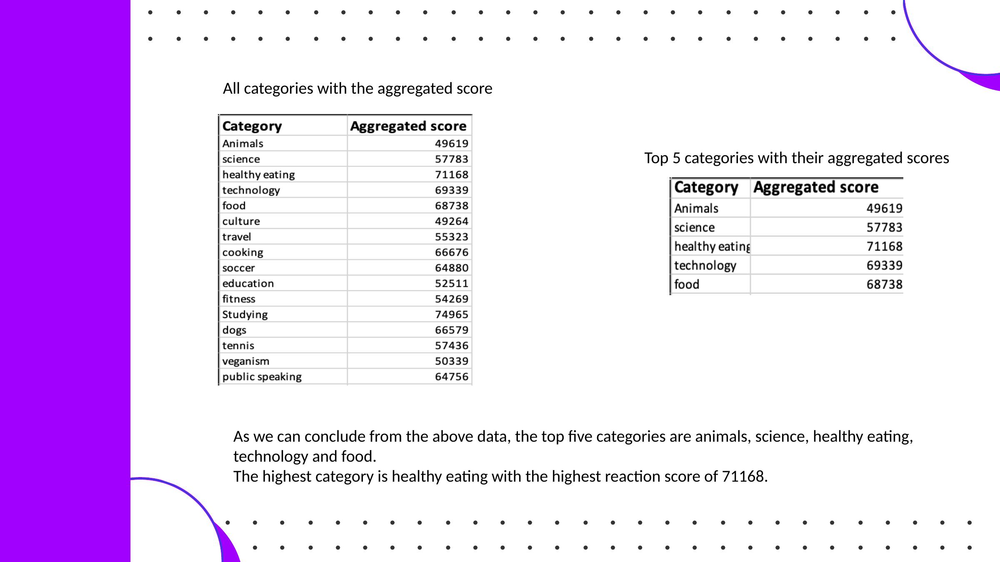
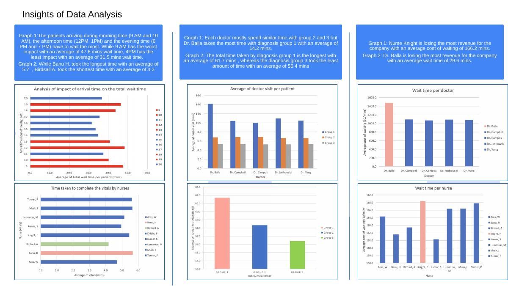
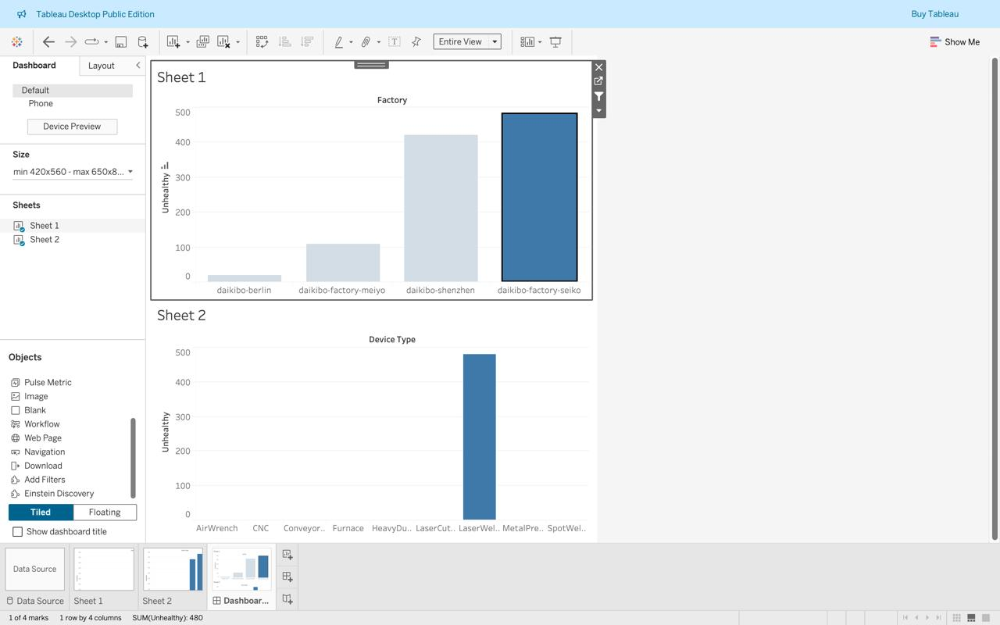

# Rishu Mandal — Data Analytics Portfolio

A compact portfolio of hands-on analytics, visualization, and business problem-solving work.

## Focus
- Data cleaning and validation
- Excel analysis and pivot-based reporting
- SQL and analytical problem solving
- Tableau / dashboard visualization
- Insight generation and executive communication
- Structured business problem solving

## Quick navigation
- [Accenture — Social Buzz: Content Popularity Analysis](projects/social-buzz/)
- [KPMG — Healthy Co.: Patient Experience and Wait-time Analysis](projects/healthy-co/)
- [Deloitte — Manufacturing Telemetry Visualization](projects/deloitte/)
- [BCG — Strategy Consulting Exercises](projects/bcg/)
- [Visualizations](visualizations/)
- [Certifications](certificates/)
- [Resume](resume/Rishu_Mandal_Resume.pdf)

## Projects at a glance

| Project | Focus | Tools |
|---|---|---|
| [Accenture](projects/accenture/) | Content popularity & engagement analysis | Excel, data cleaning, aggregation |
| [KPMG](projects/kpmg/) | Patient wait time & operational analysis | Excel, pivot analysis |
| [Deloitte](projects/deloitte/) | Manufacturing telemetry visualization | Tableau |
| [BCG](projects/bcg/) | Strategy & structured problem solving | Business analysis, brainstorming |

## Featured projects

### 1. Accenture — Social Buzz: Content Popularity Analysis
**Tools:** Excel, data cleaning, aggregation, PowerPoint

Analyzed reaction-level social media data to identify the five content categories with the largest aggregate popularity. The cleaned dataset contains 24,598 data rows, and the analysis identified **healthy eating (71,168)** as the highest-scoring category, followed by technology (69,339), food (68,738), science (57,783), and animals (49,619).

**Included:** cleaned workbook, presentation, actual project slide screenshot, and reconstructed data visualization.

### 2. KPMG — Healthy Co.: Patient Experience & Wait-Time Analysis
**Tools:** Excel, pivot analysis, dashboard presentation, structured research

Analyzed patient-flow data to examine arrival-time effects, nurse processing time, diagnosis-group visit duration, doctor waiting time, and wait-related cost. The model identifies **Dr. Balla at 29.6 minutes average doctor wait**, versus roughly 21–22 minutes for the other listed doctors, and **$1,481.64 average doctor wait cost per visit**.

**Included:** analysis deck, model-answer workbook, actual dashboard slide, and data-derived visualizations.

### 3. Deloitte — Manufacturing Telemetry Visualization
**Tools:** Tableau Public

Created a Tableau dashboard from manufacturing telemetry data, visualizing unhealthiness by factory and device type.

**Included:** the actual Tableau screenshot used in the project.

### 4. BCG — Strategy Consulting Exercises
**Tools:** structured problem solving, brainstorming, mental-model reframing

Completed BCG exercises on challenging assumptions, reframing business questions, and generating new strategic perspectives for a fictional luxury clothing brand.

**Included:** completed workbooks and an actual slide screenshot.

## Selected Visualizations

### Accenture — Social Buzz


### KPMG — Healthy Co


### Deloitte — Manufacturing Telemetry


### BCG — Strategy Consulting
, May 2025
- Deloitte — Data Analytics Job Simulation (Forage), April 2025
- BCG — Introduction to Strategy Consulting Job Simulation (Forage), April 2025
- KPMG - Career Catalyst: Advisory Job Simulation (Forage), May 2025

## Resume
See `resume/Rishu_Mandal_Resume.pdf`.

## Portfolio structure
```text
data-analytics-portfolio/
├── README.md
├── resume/
├── projects/
│   ├── social-buzz/
│   ├── healthy-co/
│   ├── deloitte/
│   └── bcg/
├── visualizations/
└── certificates/
```

> The visualizations in this folder are based on the supplied project datasets/workbooks or are direct screenshots of the completed project work. No placeholder charts are used.
